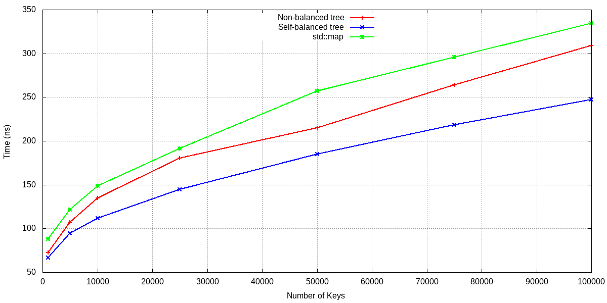
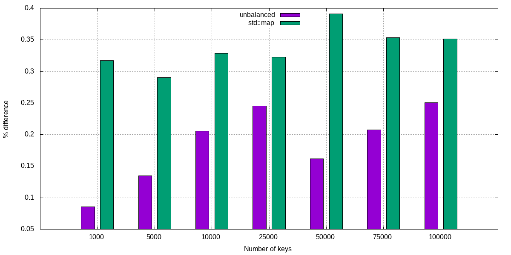

# Binary search tree

## Implementation details

We implement a `class <Tkey,Tval> Tree` in the header file `tree.h`. It has the following private attributes:

- a `std::size_t _size` , which stands for the total number of nodes, initialized to `0`;
- a `struct Node` which, in turn, contains:
  - a `std::pair<Tkey,Tval> _leaf`, to store the key and the corresponding value;
  - a pointer `Node* _parent` to the parent node (which points to `nullptr` if the node is root) ;
  - a an array `std::unique_ptr<Node> _next[2]` for the left and right pointers (see below for why we preferred an array over two distinct pointers) ;
  - a constructor for `_leaf` and`_parent`;

- a `std::unique_ptr<Node> root `, pointing to the first node;
- three auxiliary functions `Node* _find`, `void copy_graph`, and`Node* _extremum`, with the following behavior:
  - `Node* _find` looks for a given key; if the key exists, it returns a pointer to the corresponding node; otherwise, it returns its "would-be" parent pointer; it is used in the `insert` function allocate to a new key, and in the `find()` iterator;
  - `void copy_graph` is a recursive function, which copies an external (sub-)tree into the tree calling it; notice that the desired behavior is obtained IFF the calling tree is initially empty; indeed, we use this function only to implement the copy constructor;
  - `Node* _extremum` takes as argument a `bool b` , and returns the left-most node (if `b=0`) or the right-most node (if `b=1`), starting from `root`; it is used to avoid code duplication in the implementation of the iterators `begin(), end(), cbegin(), cend()`.

Let us explain why we opted for an array `_next[2]` to define the left and right pointers. The reason is essentially avoiding code duplication and annoying code lines. Indeed, with two distinct pointers, the typical implementation to insert a new key would contain something like (in pseudo code): 

- `if key<local_ley: left->insert_Node(key,val)` etc.
- `else: right->insert_Node(key,val)` etc.

With our implementation, one avoids the if statements by simply writing 

- `_next[bool{key>local_key}]->Node(key,val)` etc.

where it is understood that `_next[0]` is the left pointer and `next[1]` is the right one. We realize that our implementation can have the drawback to make the code less readable.

Now we comment, where needed, on the implementation of the mandatory functions:

- `insert`: if a key is already present, a warning is returned in output, and the pair is not allocated; the design is of course flexible to be changed.
- `balance`: we implemented two distinct versions of the balance operation: (i) the function `balance` does not modify the original tree, but merely balances it into a second tree, which is returned; (ii) the function `self_balance`, instead, is a `void` in that it replaces the original tree with its balanced version. However, please notice that `self_balance` does not occur "in place": it is implemented by first balancing the tree into a second temporary tree `tmp` , then swapping the pointers and deleting `tmp`.
- we implemented the optional operator `[]` , in both constant and non-constant versions.
- in the definition of the `class Iterator`, the dereferencing operator `*it` returns the `std::pair<Tkey,Tval>` of the corresponding node. For printing `*it` , we override the operator `<<` in order to print a `std::pair` in the form `(key:val)`.
- the only other public member, besides the mandatory ones and the optional `[]`, is an iterator `head()`, which returns an iterator to the `root` pointer, although we never use it in the class implementation. We used it in our tests, to check that the balance operation returned the correct novel `root`.

## Tests

We performed two tests: a generic test and a specific test. The`generic_test.cc` checks all the public features of the `class Tree`. It is self explanatory, as you can read in the commented lines of the code.

#### Specific test

The specific test focuses on the function `find()`, with the aim of compare its performance in three cases: in a non-balanced tree, in the balanced version of the tree, and in the corresponding `std::map`. By performance, we mean the averaged elapsed time spent to find an element. The test is performed by the code `test_find.cc`, together with the scripts contained in the folder `/scripts`.

We choose reference sizes from`N = 10^3` to `N = 10^5`. For each `N`, we allocate a ` Tree<int,int>` and we insert in it `N` random numbers, with values from `0` to `N-1`. (Notice that, since the numbers are generated randomly, we expect by a rule of thumb that only about 68% of them will be actually inserted, because the others will merely be repetitions; indeed, we actually verified that this expectation is good with a good approximation.)

Then, we instruct the code to do the following:

- Use `find()` to look for `N/2` random numbers in the tree, and compute the averaged elapsed time spent to find a single number;
- repeat the previous task for the balanced version of the tree;
- repeat again the task for the corresponding `std::map`.

You can compile the code with the `Makefile`, and run the script `/scripts/run.sh` to generate the data `/data/data.txt`. Then, you can plot the data using the script `/scripts/plot.sh`. The results are shown in the two plots here below.

The first plot shows the the averaged elapsed time (in ns). We see that to find a key with std::map has always the worst performance, while the best case is with the balanced-tree.

This analysis is reinforced by the second plot, which shows the relative performances of, respectively, the non-balanced tree and the `std::map` , w.r.t. the balanced tree (the best performer).

